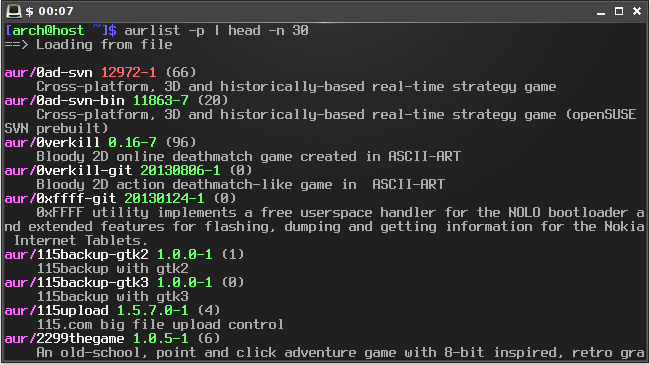

aurlist
=======

Download list of all AUR packages and search colorized list

---

USAGE: aurlist [ACTION]
USAGE: aurlist [OPTION] [KEYWORD]

ACTIONS:
  -p, --print     print full list
  -u, --update    download AUR list
  -v              enable verbose mode
  -vv             enable very verbose mode

SEARCH OPTIONS:
  [NONE]          search by name and description
  -x              search by exact name
  -n              search by package name
  -d              search by description
  -c              search with custom commands
-r              search with raw output
--nocolor       disable color output
